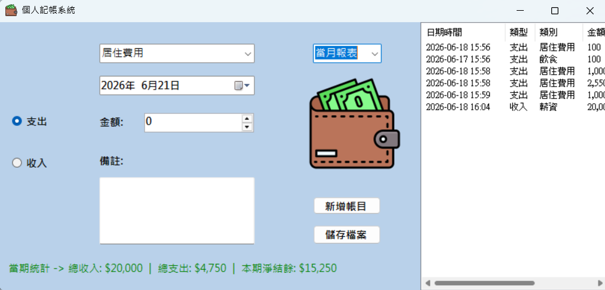

# PersonalFinanceApp - 互動式個人記帳與多功能報表系統

本專案是一個基於 C# Windows Forms (WinForms) 架構開發的個人財務記帳系統。採用**物件導向程式設計 (OOP)** 概念，將每筆帳目結構化封裝，並透過自訂類別集合實現**即時資料篩選、多維度報表切換（日報、週報、月報）與本期結餘動態統計**。同時具備檔案讀寫功能，確保記帳資料在程式關閉後能永久保存。

## 🚀 系統核心功能

1. **雙向帳目分類管理**：支援「收入」與「支出」兩大基本型態，並提供動態關聯選單（如：收入對應薪資/獎金；支出對應餐飲/休閒）。
2. **完整日期時間整合**：內建 `DateTimePicker` 控制項，讓使用者能精確指定記帳時間，或依據選定時間即時調閱歷史報表。
3. **動態多維度報表**：提供 3 種報表檢視模式（當日、當週、當月），能依據所選日期自動篩選出對應範圍的帳目。
4. **即時財務健康回報**：即時計算當期總收入、總支出，並動態計算「本期淨結餘」。若淨結餘為負（透支狀態），系統將以紅色字體發出警告。
5. **資料結構化儲存 (TSV 格式)**：不依賴大型資料庫，直接以純文字 Tab 鍵分隔檔案（Tab-Separated Values）進行讀寫，格式相容於 Excel，便於後續擴充與檢視。

---

## 🛠️ 開發環境與控制項配置

### 1. 開發環境
* **開發語言**：C# 12
* **框架技術**：.NET 6.0 / 8.0 或 .NET Framework (Windows Forms)

### 2. 主要控制項與屬性配置表 (`Form1.cs`)
* **RadioButtons (`rdoExpense`, `rdoIncome`)**：切換記帳類型（預設為支出）。
* **ComboBox (`cmbCategory`)**：動態載入相應的消費或收入類別。
* **DateTimePicker (`dtpDate`)**：提供使用者選取記帳時間或做為報表查詢基準點。
* **NumericUpDown (`numAmount`)**：金額輸入（設定 `Minimum: 0` 防止輸入負數）。
* **TextBox (`txtNote`)**：備註欄位。
* **ComboBox (`cmbReportView`)**：報表切換選單，內含「當日報表」、「當週報表」、「當月報表」。
* **ListView (`lvwAccounts`)**：呈現結構化帳目清單。
    * `View`: `Details` (詳細資料模式)
    * `FullRowSelect`: `True` (整列選取)
    * **表頭欄位**：「日期時間」、「類型」、「類別」、「金額」、「備註」。
* **Label (`lblSummary`)**：位於畫面最下方，顯示收入、支出、結餘等總計。

---

## 💻 核心程式碼設計架構

專案主要由三個核心程式檔案構成，架構彼此分離、分工明確：

### 一、 帳目明細類別：`AccountItem.cs`
負責封裝單一筆記帳資料的完整屬性，並實作檔案行字串的互轉邏輯。
```csharp
public class AccountItem
{
    public DateTime Date { get; set; }
    public string Type { get; set; }       // "收入" 或 "支出"
    public string Category { get; set; }   // 項目分類
    public int Amount { get; set; }        // 金額
    public string Note { get; set; }      // 備註

    // 自 TSV 文字行解析載入物件
    public AccountItem(string line) { ... }
    // 轉換為符合 TSV 的單行儲存格式（並自動濾除使用者輸入的 Tab 鍵）
    public string ToLineString() { ... }
}
```

### 二、 自訂帳目集合類別：AccountCollection.cs
繼承自 Collection<AccountItem>，利用 LINQ 技術 將報表篩選邏輯內聚於此，提供主表單最乾淨的呼叫介面。
```csharp
public class AccountCollection : Collection<AccountItem>
{
    public void LoadFromFile(string filePath) { ... } // 讀取 UTF-8 文字檔
    public void SaveToFile(string filePath) { ... }   // 批次寫入文字檔
    
    // 核心 LINQ 篩選報表函式
    public AccountItem[] GetDailyReport(DateTime targetDate) { ... }
    public AccountItem[] GetWeeklyReport(DateTime targetDate) { ... }
    public AccountItem[] GetMonthlyReport(DateTime targetDate) { ... }
}
```

### 三、 表單主程式邏輯：Form1.cs
處理 UI 的即時連動、事件監聽與畫面的動態更新（重繪控制項）。

- 即時連動機制：當使用者觸發 Form1_Load、新增項目、切換報表模式或改變查詢日期時，皆會呼叫核心 RefreshReport() 函式。

- 繪圖效能優化：在重繪 ListView 填入大批帳目時，使用 BeginUpdate() 與 EndUpdate() 暫停視窗重繪，大幅優化畫面載入速度並防止閃爍。

### 📖 操作步驟指引
- 記帳輸入：

選擇「收入」或「支出」單選鈕，此時「類別」下拉選單會自動同步切換。

輸入金額與備註，選擇好日期時間後，點擊 「新增項目」 鈕。

- 切換報表查閱：

更改「日期選擇器 (dtpDate)」的日期。

透過報表下拉選單切換至「當日/當週/當月報表」，下方的 ListView 清單與淨結餘金額將會立刻連動刷新。

- 存檔與自動備份：

記帳結束後點擊 「儲存檔案」 鈕，系統會自動在程式根目錄下建立或更新 finance_data.txt。

即使忘記點擊儲存，在關閉視窗時，系統也會跳出二次防呆確認提示框，詢問是否要更新儲存後再離開。

## Screenshots


